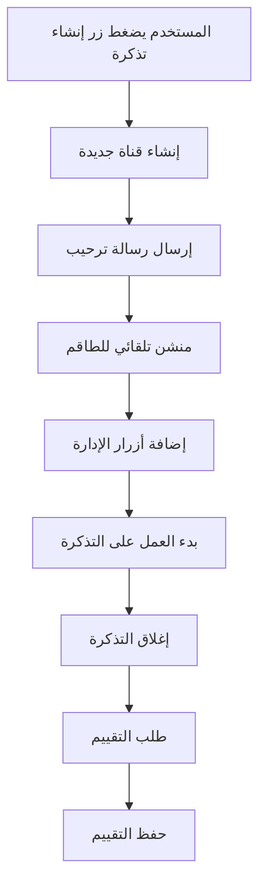

## نظام الأزرار التفاعلية

### 🎫 أزرار التذاكر
| الزر | الوظيفة | الصلاحية |
|---|---|---|
| **إنشاء تذكرة** | فتح تذكرة جديدة | جميع المستخدمين |
| **إغلاق التذكرة** | إغلاق التذكرة الحالية | Moderator+ |
| **تأكيد الإغلاق** | تأكيد إغلاق التذكرة | Moderator+ |
| **إلغاء الإغلاق** | إلغاء عملية الإغلاق | Moderator+ |
| **استلام التذكرة** | استلام التذكرة للعمل عليها | Moderator+ |

### ⭐ أزرار التقييم
| الزر | الوظيفة | الصلاحية |
|---|---|---|
| **تقييم جيد** | تقييم الخدمة كجيدة | صاحب التذكرة |
| **تقييم سيء** | تقييم الخدمة كسيئة | صاحب التذكرة |

## نظام التفاعلات الذكي

### 🔄 التدفق التلقائي


### 📢 الإشعارات التلقائية
- **منشن الطاقم**: عند فتح تذكرة جديدة
- **تنبيهات الحالة**: عند تغيير حالة التذكرة
- **إشعارات الإغلاق**: عند إغلاق التذكرة
- **تذكيرات التقييم**: بعد إغلاق التذكرة

### 🎯 الأتمتة الذكية
- **تسمية تلقائية**: تسمية القنوات حسب نوع التذكرة
- **أذونات تلقائية**: منح الصلاحيات المناسبة
- **أرشفة تلقائية**: نقل التذاكر المغلقة
- **تنظيف تلقائي**: حذف التذاكر القديمة

## إعدادات التفاعلات

### ⚙️ تخصيص الأزرار
```javascript
// مثال على إعداد أزرار التذاكر
const ticketButtons = new ActionRowBuilder()
  .addComponents(
    new ButtonBuilder()
      .setCustomId('create_ticket')
      .setLabel('إنشاء تذكرة')
      .setStyle(ButtonStyle.Primary)
      .setEmoji('🎫')
  );
```

### 🎨 تخصيص الرسائل
- **رسائل الترحيب**: قابلة للتخصيص
- **رسائل الإغلاق**: قوالب متعددة
- **رسائل التقييم**: نصوص مخصصة
- **رسائل الخطأ**: رسائل واضحة

## أفضل الممارسات

:::tip نصائح للطاقم
- استخدم أزرار التقييم لتحسين الخدمة
- تأكد من الرد السريع على التذاكر الجديدة
- استخدم أزرار الإدارة للتحكم المنظم
:::

:::warning تحذيرات مهمة
- لا تترك التذاكر مفتوحة لفترة طويلة
- تأكد من إغلاق التذاكر بعد الحل
- اطلب التقييم دائماً لتحسين الخدمة
:::
