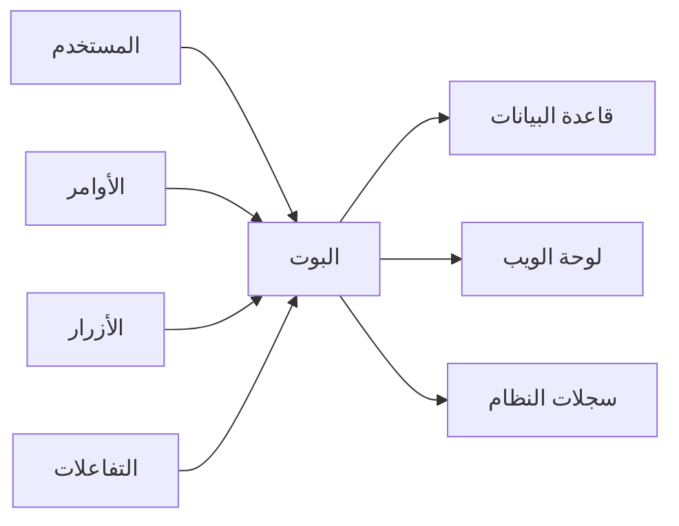

  <h4>نظام البوت المتكامل</h4>
  

    بوت ديسكورد متقدم يدير نظام التذاكر بشكل كامل مع واجهة تفاعلية حديثة
    ومزامنة فورية مع لوحة الويب.
  

## المزايا الرئيسية

### 🎯 الأوامر التفاعلية
- **أوامر Slash Commands**: أوامر حديثة وسهلة الاستخدام
- **أوامر Prefix**: أوامر تقليدية للتحكم السريع
- **تفاعل ذكي**: استجابة تلقائية للطلبات

### 🔘 الأزرار والتفاعلات
- **أزرار إنشاء التذاكر**: واجهة بصرية لفتح التذاكر
- **أزرار الإدارة**: تحكم سريع في التذاكر
- **نظام التقييم**: تقييم جودة الخدمة

### ⚙️ الإعدادات المتقدمة
- **إعدادات مرنة**: تخصيص كامل للنظام
- **أتمتة ذكية**: معالجة تلقائية للعمليات
- **سجلات مفصلة**: تتبع جميع الأنشطة

## البنية التقنية

## المكونات الأساسية

### 1. نظام الأوامر
- **أوامر الإعداد**: `$setup` و `/setup`
- **أوامر التذاكر**: `$ticket` و `/ticket`
- **أوامر المساعدة**: `$help`

### 2. نظام التفاعلات
- **أزرار التذاكر**: إنشاء وإدارة التذاكر
- **أزرار التقييم**: تقييم الخدمة
- **قوائم الاختيار**: خيارات متقدمة

### 3. نظام الإشعارات
- **إشعارات فورية**: تنبيهات للطاقم
- **تحديثات الحالة**: متابعة التذاكر
- **تقارير دورية**: إحصائيات منتظمة
