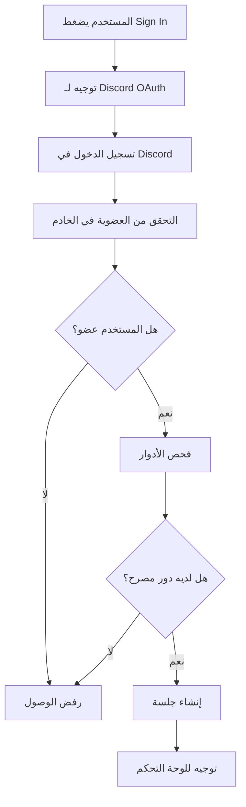

## نظام المصادقة المتقدم

### 🔐 تسجيل الدخول
- **OAuth Discord**: تسجيل دخول آمن عبر Discord
- **تحقق تلقائي**: فحص الصلاحيات والأدوار تلقائياً
- **جلسات آمنة**: إدارة آمنة لجلسات المستخدمين
- **تسجيل خروج تلقائي**: انتهاء الجلسة بعد فترة عدم نشاط

### 👥 إدارة الأدوار
- **تحميل من Discord**: الأدوار تُحمّل مباشرة من الخادم
- **مطابقة السياسات**: فحص الأدوار حسب السياسات الداخلية
- **تحديث فوري**: تحديث الصلاحيات عند تغيير الأدوار
- **تحكم دقيق**: صلاحيات محددة لكل دور

## أنواع المستخدمين

### 🔧 الإداريون
- **وصول كامل**: جميع المزايا والإعدادات
- **إدارة النظام**: تحكم في جميع جوانب النظام
- **إدارة المستخدمين**: إضافة وإزالة أعضاء الطاقم
- **إعدادات متقدمة**: الوصول للإعدادات الحساسة

### 🛡️ الرقابيون
- **إدارة التذاكر**: عرض وإدارة جميع التذاكر
- **التقارير**: الوصول للتقارير والإحصائيات
- **أدوات الإدارة**: استخدام أدوات إدارة التذاكر
- **محدودية الإعدادات**: لا يمكن تعديل الإعدادات الحساسة

### 📊 المسؤولون
- **عرض التقارير**: الوصول للتقارير والإحصائيات
- **مراجعة البيانات**: عرض وتحليل البيانات
- **تقارير محدودة**: تقارير حسب الصلاحية
- **لا يمكن التعديل**: عرض فقط بدون إمكانية التعديل

### 💻 المبرمجون
- **وصول API**: استخدام واجهات البرمجة
- **أدوات التطوير**: أدوات متقدمة للتطوير
- **إعدادات تقنية**: إعدادات متقدمة للنظام
- **صلاحيات محدودة**: حسب الحاجة التقنية

## عملية المصادقة

### 🔄 التدفق الكامل


### 🛡️ الأمان والحماية
- **HTTPS**: جميع الاتصالات مشفرة
- **JWT Tokens**: رموز آمنة للجلسات
- **Rate Limiting**: حماية من الهجمات
- **Audit Logs**: سجلات مفصلة للأنشطة

## إعدادات المصادقة

### ⚙️ التكوين
```javascript
// مثال على إعدادات المصادقة
const authConfig = {
  discord: {
    clientId: process.env.DISCORD_CLIENT_ID,
    clientSecret: process.env.DISCORD_CLIENT_SECRET,
    redirectUri: 'https://ksa1980.lol/api/auth/callback/discord'
  },
  roles: {
    admin: process.env.ADMIN_ROLE_ID,
    moderator: process.env.MODERATOR_ROLE_ID,
    auditor: process.env.AUDITOR_ROLE_ID,
    developer: process.env.DEVELOPER_ROLE_ID
  }
};
```

### 🔧 إدارة الجلسات
- **مدة الجلسة**: 24 ساعة افتراضياً
- **تحديث تلقائي**: تجديد الجلسة عند النشاط
- **تسجيل خروج آمن**: إنهاء الجلسة بشكل آمن
- **جلسات متعددة**: دعم عدة جلسات للمستخدم الواحد

## استكشاف الأخطاء

### ❌ مشاكل شائعة
- **خطأ في المصادقة**: تحقق من إعدادات Discord
- **عدم ظهور الأدوار**: تأكد من إعدادات الخادم
- **مشاكل الجلسة**: امسح الكوكيز وأعد المحاولة
- **رفض الوصول**: تحقق من الأدوار والصلاحيات

### 🔧 حلول سريعة
1. **تحديث الصفحة**: إعادة تحميل الصفحة
2. **مسح الكوكيز**: حذف بيانات المتصفح
3. **تسجيل خروج/دخول**: إنهاء الجلسة وإعادة الدخول
4. **التحقق من الأدوار**: تأكد من الأدوار في Discord
