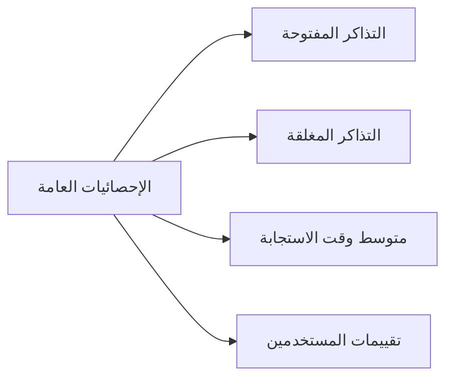

  <h4>لوحة التحكم المتقدمة</h4>
  

    واجهة ويب حديثة ومتطورة لإدارة نظام التذاكر مع مزايا متقدمة
    وإحصائيات مفصلة للطاقم المصرح له.
  

## المزايا الرئيسية

### 📊 لوحة الإحصائيات
- **إحصائيات فورية**: أعداد التذاكر المفتوحة والمغلقة
- **مؤشرات الأداء**: متوسط وقت الاستجابة وحل التذاكر
- **رسوم بيانية**: تمثيل مرئي للبيانات والاتجاهات
- **تقارير دورية**: إحصائيات يومية وأسبوعية وشهرية

### 🎫 إدارة التذاكر
- **عرض التذاكر**: قائمة شاملة لجميع التذاكر
- **فلترة متقدمة**: بحث حسب الحالة، التاريخ، النوع
- **إجراءات دفعية**: معالجة عدة تذاكر في نفس الوقت
- **تحديث فوري**: مزامنة لحظية مع البوت

### ⚙️ إعدادات النظام
- **إعدادات البوت**: تحكم في إعدادات البوت
- **إدارة المستخدمين**: إضافة وإزالة أعضاء الطاقم
- **تخصيص النظام**: إعدادات مخصصة للخادم
- **نسخ احتياطي**: إدارة النسخ الاحتياطية

## واجهة المستخدم

### 🎨 التصميم الحديث
- **واجهة داكنة**: تصميم عصري ومريح للعين
- **ألوان متناسقة**: نظام ألوان بنفسجي وأخضر
- **تصميم متجاوب**: يعمل على جميع الأجهزة
- **تجربة سلسة**: تنقل سهل وسريع

### 📱 التوافق
- **أجهزة سطح المكتب**: تجربة كاملة ومتقدمة
- **الأجهزة اللوحية**: واجهة محسنة للشاشات المتوسطة
- **الهواتف الذكية**: تطبيق متجاوب للاستخدام المحمول

## الأقسام الرئيسية

### 1. لوحة الإحصائيات

### 2. سجلات التذاكر
- **عرض التذاكر**: قائمة مفصلة بجميع التذاكر
- **فلترة متقدمة**: بحث وفلترة حسب معايير متعددة
- **تفاصيل التذكرة**: عرض كامل لمحتوى التذكرة
- **سجل المحادثة**: تاريخ كامل للمحادثة

### 3. إعدادات النظام
- **إعدادات البوت**: تحكم في سلوك البوت
- **إدارة الأدوار**: إعداد صلاحيات الطاقم
- **تخصيص الرسائل**: تعديل رسائل النظام
- **إعدادات الأمان**: تحكم في الوصول والأمان

## المزايا المتقدمة

### 🔄 المزامنة الفورية
- **تحديث تلقائي**: مزامنة فورية مع البوت
- **إشعارات فورية**: تنبيهات للتذاكر الجديدة
- **تحديث الحالة**: تغيير حالة التذاكر فورياً

### 📈 التحليلات المتقدمة
- **تحليل الاتجاهات**: فهم أنماط الاستخدام
- **تقارير الأداء**: قياس كفاءة الطاقم
- **تحليل التقييمات**: فهم رضا المستخدمين

### 🛡️ الأمان والحماية
- **مصادقة OAuth**: تسجيل دخول آمن عبر Discord
- **صلاحيات متدرجة**: تحكم دقيق في الوصول
- **سجلات التدقيق**: تتبع جميع الأنشطة
