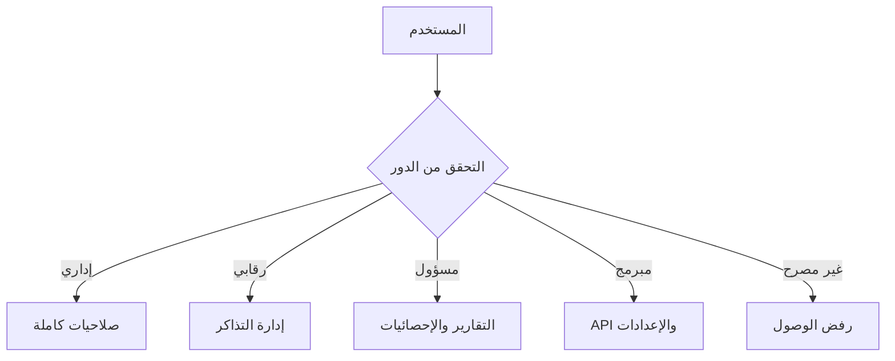

## هيكل الأدوار

### 🔧 الإداريون (Administrators)
**الصلاحيات:**
- إعدادات النظام الكاملة
- إدارة جميع التذاكر
- الوصول لجميع التقارير والإحصائيات
- إدارة البوت والإعدادات المتقدمة
- إضافة/إزالة أعضاء الطاقم

**المسؤوليات:**
- وضع السياسات والإجراءات
- مراجعة الأداء العام
- اتخاذ القرارات الاستراتيجية

### 🛡️ الرقابيون (Moderators)
**الصلاحيات:**
- إدارة التذاكر اليومية
- الوصول لتقارير التذاكر
- استخدام أوامر البوت التفاعلية
- مراجعة سجلات النشاط

**المسؤوليات:**
- التعامل مع التذاكر من الفتح للإغلاق
- ضمان الامتثال للقوانين
- تقديم الدعم الفني

### 📊 المسؤولون (Auditors)
**الصلاحيات:**
- عرض التقارير والإحصائيات
- مراجعة سجلات التدقيق
- الوصول للبيانات التحليلية

**المسؤوليات:**
- إعداد التقارير الشهرية
- مراقبة الأداء والجودة
- تحليل الاتجاهات

### 💻 المبرمجون (Developers)
**الصلاحيات:**
- الوصول لـ API
- إعدادات متقدمة
- أدوات التطوير والاختبار
- إدارة قاعدة البيانات

**المسؤوليات:**
- صيانة النظام التقني
- تطوير مزايا جديدة
- حل المشاكل التقنية

## نظام الصلاحيات

